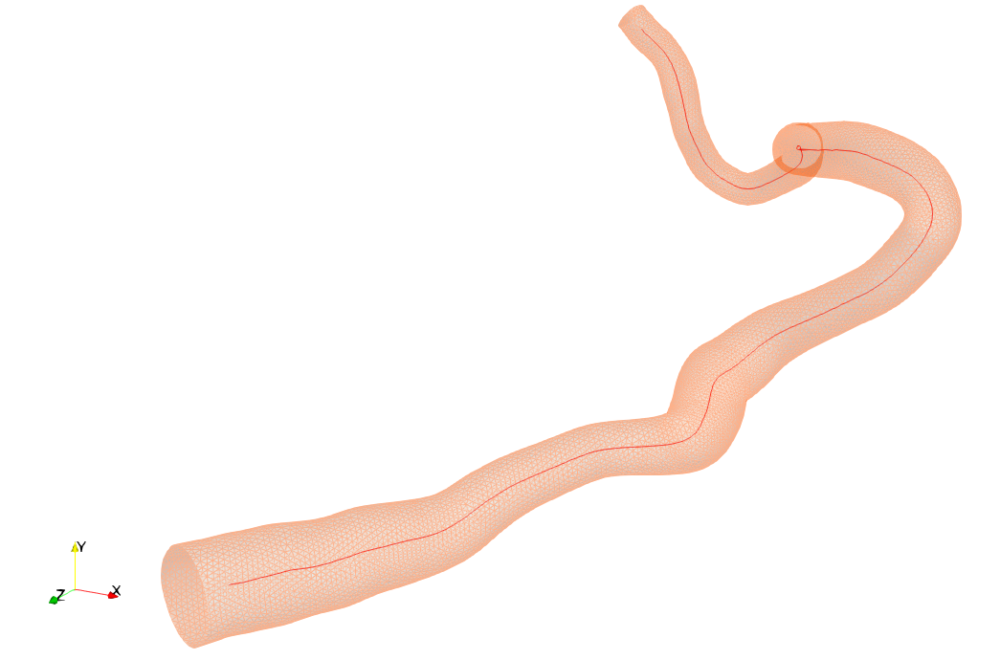

# Overview
チューブ形状のstlデータから、中心線情報を抽出する。

## 使用しているもの
* vmtk 1.4.0 (vmtkSetup参照)
* paraview
 

## usage
vmtkcenterlines コマンドにより、stlデータから中心線データ(*.vtp)が出力できる 
http://www.vmtk.org/tutorials/Centerlines.html
 
手順は usage.pptx にまとめた。入力となるstlデータのサンプルはassetsに入れた。

## Result 
入力ファイルであるstlデータと、得られた中心線データ(*.vtp)をparaviewで表示すると下のようになる。 

よく見ると、中心線の端が端面に届いていないことが分かる。これは、vmtkcenterlineのアルゴリズムでは中心線の点を形状の最大内接球の中心として求めるためだと考えられる。中心線を端面まで作りたい場合は、追加で処理を加える必要がありそう。
