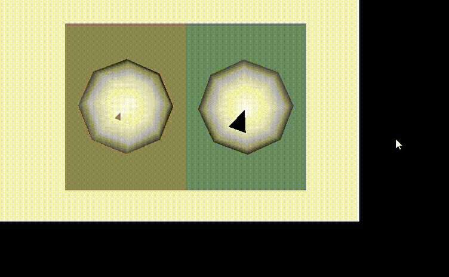
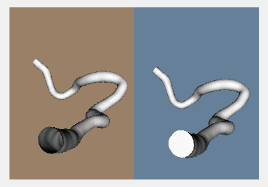
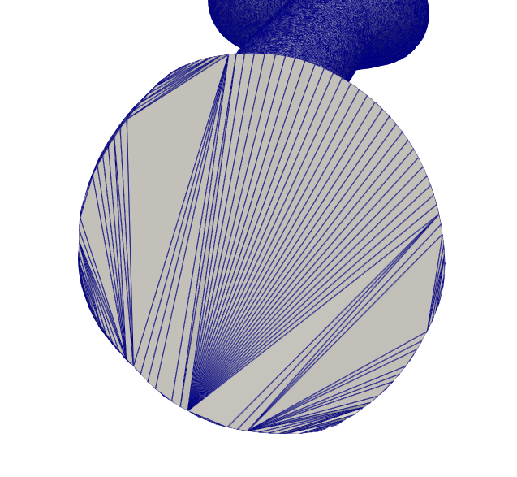
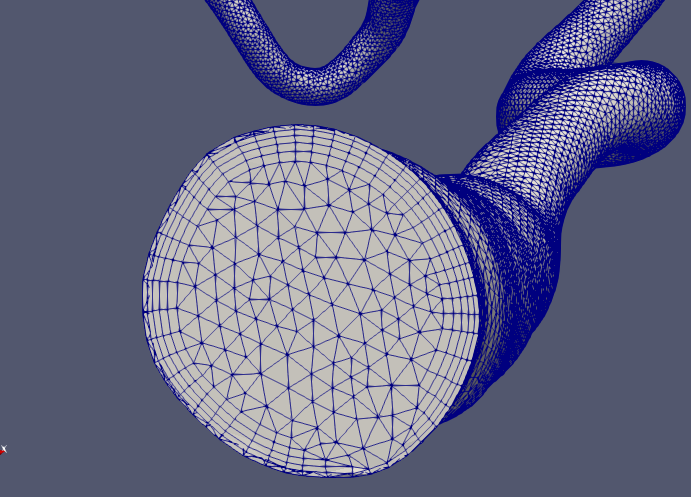

# fillHolesとは
VTKが提供する、三次元形状の表面で穴が開いている箇所を三角形パッチで埋める処理をするメソッド。ちなみにvmtk(Vascular Modelling Toolkit)でも全く同じ事が出来て、
 
 
vmtksurfacecapper -ifile C:/.../inputFilename.stl -ofile C:/.../oututFilename.stl 
 
 
コマンドを実行すると、同じように三角形パッチが追加された出力データが得られる。一か所ずつしか穴埋めができないことと、毎回処理後にアプリケーションの応答がなくなるため再起動する必要がある。(vmtkについてはvmtkSetupを参照)

# 用途
医用画像から輝度値で判別した血管領域をセグメンテーションし、3次元形状を得るのが血管形状モデリングの最初のワークフローだが、この際に得られる3次元形状では、端面(血流の流入面と流出面)は穴が開いている。  
一方で、流入面や流出面は塞がっていないと(閉じた領域でないと)、ICEM CFD でメッシュを切ることができない(流れのINLETやOUTLETを面として指定するため)(*1)。
セグメンテーションした血管形状のうち、一部を切り出して使う場合はmeshmixerで切り出す際に端面を塞いでくれるが、セグメンテーションした形状すべてを流体解析したい場合や、自身で3DCGソフトウェアを使ってチューブ形状を作成した場合など、両端が穴が開いている形状に対してICEMでメッシュを切りたいときは、端面を埋める処理が必要になる。 
(はじめは Blendy 等の3DCGソフトウェアで、GUIで端面を追加する方法を試したが、ICEMでメッシュを切る段階でエラーが出た)

# 環境
* Windows 10 or higher
    * visual studio 2022
        * .NET Framework 4.8
        * VTKライブラリ (NuGetパッケージマージャーでActiviz.Net.x64(5.8.0)をインストール)

# 参考
https://examples.vtk.org/site/PythonicAPI/Meshes/FillHoles/    
上記サイトを参考にしている。tutorial フォルダでは、上記のサンプルコードの動作確認をしている。下のように、穴の開いた球体(左側)の穴が、三角形パッチで埋められている(右側)。 
閉じたい領域が単純な形状なら、境界線上のNode数が多くてもfillHoles処理で埋めることができる(fillHoles_vascular)。

 

## tutorial

## fillHoles_vascular

 
stlファイルを読み込み、端面を埋める処理をしてstlとして出力する。上の図で、左は処理前の形状で、右は処理後の形状。端面が埋まっていることが確認できる。
 

出力されたstlファイルをparaviewで表示し、拡大してみたのが上の図。このように境界線上のNodeから三角形パッチを多数作ることで、表面形状を作成する。 
ICEM CFD では、どこまでを「まとまった1つの面」と認識するかに、隣り合う三角形パッチの法線ベクトルのなす角度を用いている。ユーザーが閾値を設定し(例えば45°など)、隣り合う三角形パッチの法線ベクトル同士のなす角がその閾値を超えると、それらを別の面だと認識する。したがって、基本的には上の図の用に三角形パッチの形が悪くてもメッシュを切る際に問題はない。しかし、ICEM CFD で流入面、流出面、壁面の3つに分類する際に、境界線付近は三角形パッチが密集していて非常に「ギザギザ」しており、同じ面だと認識されない部分があった。手動で同一の面の定義を与えたが、このような部分はメッシュの生成時に悪影響を及ぼすと考えられる。
 
 

実際にICEM CFD でテトラ-プリズム複合メッシュに分割した結果が上の図。
「ギザギザ」していた部分に対応する、外側メッシュ(=プリズムメッシュ)が歪んでいる。反対側の端面はきれいにメッシュが切れた。OpenFOAMで計算は実行できた。これは極端な例で、別の形状(例えばassets/wall_90.stl)でfillHolesにより端面を追加した場合、綺麗にメッシュが切れる。ICEM CFD で作成したこのメッシュファイルはassetsにある。

 
 
 

#### 注釈
*1 ...  
vmtkにはstlデータからテトラプリズム複合メッシュを切る機能もあって、元のstlは管壁のみでよく、流入面や流出面が空いていていいらしい  
https://www.rccm.co.jp/icem/pukiwiki/index.php?%E8%A1%A8%E9%9D%A2%E3%83%A1%E3%83%83%E3%82%B7%E3%83%A5%E3%81%8B%E3%82%89%E3%83%97%E3%83%AA%E3%82%BA%E3%83%A0%E3%83%A1%E3%83%83%E3%82%B7%E3%83%A5%E3%81%AE%E4%BD%9C%E6%88%90%28vmtk%29      
さすがにメッシュの精度は有料のICEMの方がいいと思うが、時間があれば試してみたい。
