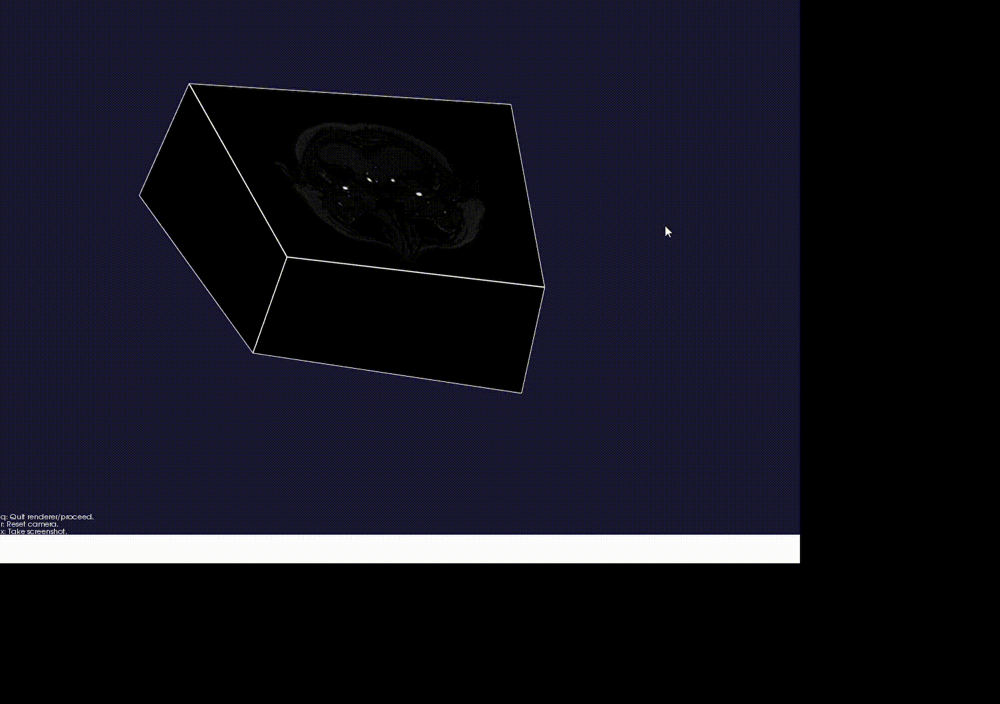

# vmtkを使えるようになるためのリポジトリ
http://www.vmtk.org/index.html

## vmtk とは
vmtk(vascular modeling toolkit) は、VTK (Visualization Toolkit) のライブラリを基盤として、血管形状モデルの処理に特化した機能を提供している。 
http://www.vmtk.org/documentation/vmtkscripts.html
 
のスクリプト一覧にあるように、ビューワ機能、セグメンテーション機能、表面平滑化、中心線抽出、曲率・ねじれ率計算、端面を塞ぐ(capping)、メッシュ作成...etc など様々な処理を簡単に実行できる。

## インストール
setup.pptx に簡単にインストール手順を書いた。

## 試しに
vmtkのCLIに  
vmtkimagereader -ifile dicom_directory_path/first_dicom_file_in_the_series --pipe vmtkimageviewer  
と入力し・実行して医用画像を表示することができる。
 
assetsに、Willis動脈輪のCT画像データを入れてある。ローカルにインストールし、上のコマンドの一部をフォルダ内のデータ群の1番上の医用画像データのフルパスに変えると、次のようにDICOM形式の画像データを見ることができる。 
 
注意 : パスの入力に関して、ディレクトリをまたぐときは/なのか￥なのか、C:の後は ￥￥なのかなど、少しでも間違っているとエラーになって厄介なので、パスをコピペして打ったりせずに、PypePad上部の「Edit」→「Insert file name」で入力ファイルを選択することでフルパスを入力する。

 
 

 
(※)このWillis動脈輪の医用画像は以下のサイトより提供されている。  
https://3dicomviewer.com/dicom-library/
